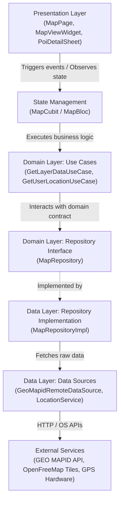

<!-- markdownlint-disable -->

# Architecture Documentation


This document serves as the canonical architectural map of the repository for the **MAPID Mobile Developer Case Study**. It outlines the design patterns, technical stack, target directory structure, and module constraints to assist developers and AI agents in navigating and maintaining the codebase safely.

## 1. Project Overview

The project is a mobile GIS application built with **Flutter** for PT Multi Areal Planing Indonesia (MAPID). The application's core responsibility is to render an interactive map with an external basemap (OpenFreeMap Liberty style via MapLibre GL), overlay a geographic feature layer fetched from the GEO MAPID API, display detailed attribute popups upon feature interaction, and acquire and visualize the device's live GPS location.

## 2. High-Level Architecture & Tech Stack

- **Primary Language:** Dart (Flutter SDK)
- **Frameworks/Libraries:**
  - `maplibre_gl`: Interactive vector map rendering and GeoJSON layer visualization.
  - `flutter_bloc` / `bloc`: Predictable state management following Clean Architecture principles.
  - `geolocator` & `permission_handler`: Device GPS acquisition and runtime permissions.
  - `http` / `dio`: REST API communication for GeoJSON layer data.
  - `flutter_dotenv`: Secure environment variable configuration (.env).
- **Architectural Pattern:** Clean Architecture (Domain, Data, Presentation) with Feature-First modularity.
- **Build/Tooling:** Flutter CLI, Gradle (Android), CocoaPods (iOS).

## 3. Data Flow & Layer Dependencies



## 4. Dependencies & External Services

- **GEO MAPID Layer API:** Endpoint `https://geoserver.mapid.io/layers_new/get_layer` providing GeoJSON `FeatureCollection` (Yogyakarta Tourism POI data).
- **OpenFreeMap Liberty Basemap:** Vector style endpoint `https://tiles.openfreemap.org/styles/liberty` rendered via MapLibre GL.
- **Device GPS / Location Services:** Hardware GPS accessed via Android Location Manager / iOS CoreLocation.

## 5. Directory Tree Map

```text
d:/kayzz/flutter/mapid/
├── .agents/              # AI Agent rules, skills, and SDLC standards
├── android/              # Native Android configuration, Manifest, Gradle scripts
├── ios/                  # Native iOS Xcode project and Podfile
├── docs/                 # Architectural maps, ADRs, and SDLC Discovery drafts
├── lib/
│   ├── core/             # Cross-cutting concerns
│   │   ├── config/       # Environment config (EnvConfig, constants)
│   │   ├── errors/       # Failures and exceptions definition
│   │   ├── network/      # HTTP client and interceptors
│   │   ├── theme/        # UI tokens, color palette, typography (ui-ux-pro-max)
│   │   └── utils/        # Location helpers, permissions, GeoJSON parser
│   ├── features/
│   │   └── map/          # Feature: Map & GEO MAPID Layer
│   │       ├── data/
│   │       │   ├── datasources/   # GeoMapidRemoteDataSource, LocationDataSource
│   │       │   ├── models/        # GeoJsonFeatureModel, LayerResponseModel
│   │       │   └── repositories/  # MapRepositoryImpl
│   │       ├── domain/
│   │       │   ├── entities/      # MapPoiEntity, UserLocationEntity
│   │       │   ├── repositories/  # MapRepository (Interface)
│   │       │   └── usecases/      # GetLayerDataUseCase, GetUserLocationUseCase
│   │       └── presentation/
│   │           ├── cubit/         # MapCubit, MapState
│   │           ├── pages/         # MapPage
│   │           └── widgets/       # MapViewWidget, PoiDetailSheet, UserLocationButton, ReturnToYogyakartaChip, ErrorCard
│   └── main.dart         # Application entry point and DI bootstrap
├── test/                 # Unit and widget test suite
├── .env.example          # Sample environment variable structure
├── .gitignore            # Git exclusion rules (ignoring .env and build outputs)
├── pubspec.yaml          # Project dependencies and asset declarations
└── README.md             # Project documentation
```

## 6. Directory Purposes & Responsibilities

| Directory/File | Primary Purpose | Contains | Rules / Constraints |
| :--- | :--- | :--- | :--- |
| `lib/core/` | Global foundation and utilities | Themes, network clients, env configs | Must not depend on any specific feature layer. |
| `lib/features/map/domain/` | Pure business rules | Entities, Use Cases, Repository interfaces | Strictly zero dependencies on Flutter UI or third-party data drivers. |
| `lib/features/map/data/` | Data retrieval & conversion | API DataSources, DTO Models, Repository Impls | Implements domain contracts; handles GeoJSON serialization. |
| `lib/features/map/presentation/` | User interface and state binding | Widgets, Pages, Cubits/Blocs | Bound to theme tokens; complies with antislop-ui guidelines. |
| `docs/` | Architecture & SDLC artifacts | `ARCHITECTURE.md`, discovery drafts, PRD, spec | Must be kept evergreen across phases. |

## 7. Key Configuration Files

- `.env`: Secret store holding `MAPID_API_KEY`, `MAPID_LAYER_ID`, `MAPID_PROJECT_ID`, and basemap URLs. **Never committed to version control.**
- `.env.example`: Safe template defining expected environment keys without secret values.
- `android/app/src/main/AndroidManifest.xml`: Declares permissions (`ACCESS_FINE_LOCATION`, `ACCESS_COARSE_LOCATION`, `INTERNET`).
- `pubspec.yaml`: Declares packages, asset paths (for `.env` and marker icons).

## 8. Entry Points

- **App Initialization:** `lib/main.dart` bootstraps environment (`dotenv.load()`), initializes service locator / dependency injection, and starts `runApp()`.
- **Primary Screen:** `MapPage` within `lib/features/map/presentation/pages/map_page.dart`.

## 9. Environment & Deployment

- **Target Platforms:** Android (APK primary deliverable), iOS compatible.
- **Environment:** Managed via `.env` loaded at runtime.
- **Build Output:** APK release artifact generated via `flutter build apk --release` or `flutter build apk --debug`.

## 10. Testing Strategy

- **Two-Layer Mandate:**
  - Micro-level: Unit tests for GeoJSON parsing models and `MapCubit` state emissions.
  - Macro-level: Verification of map initialization and widget rendering.
- **Framework:** `flutter_test`, `bloc_test`, `mocktail`.
- **Run Command:** `flutter test`.

## 11. AI Agent Boundaries

- **Surgical Edits:** Only modify lines relevant to the active ticket.
- **Antislop Enforcement:** Adhere strictly to purpose-driven UI, mobile-responsive layout (`antislop-layoutmobile`), contrast checks (`antislop-human`), and clean code comments (`antislop-code`).
- **Security Guard:** Never output API keys directly into Dart code or git commits. Always reference `.env`.
